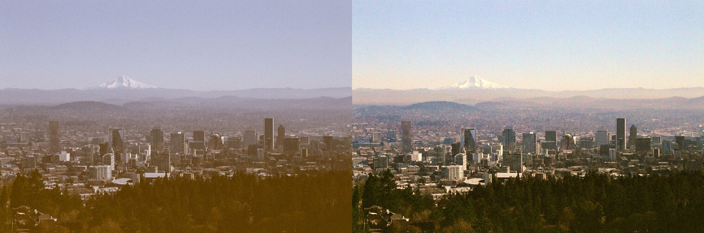
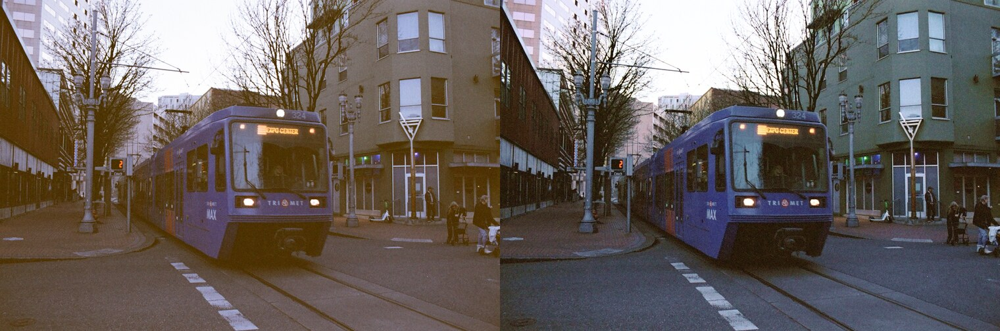

# Emulsion Profile Correction Toolkit

## Overview

Scanning software turns a colour negative into a positive using a profile for
that particular film. SilverFast's NegaFix and lab scanners only have profiles
for common stocks, so anything unusual gets scanned as if it were Kodak Gold or
Ultramax and comes back as a poor Kodak emulation, washed out and colour
shifted. This toolkit corrects those scans afterwards. Each supported film has
a profile describing how its scans go wrong, and the correction looks at the
whole roll at once, since the scanning error is the same on every frame while
the subjects change.

## Usage

You need Ruby and [libvips](https://www.libvips.org/) (`dnf install vips`,
`apt install libvips` or `brew install vips`), then `bundle install`. Point it
at a folder of scans and name the film:

```bash
./bin/emulsion --profile lomochrome-color-92 ~/scans/"47791 Lomography Color 92"
```

Corrected copies go to a new folder beside the original, in the format the
scans came in, and the originals are never touched. `--help` lists every
setting, any of which can be overridden, and `--profile` also takes the path
to a profile file of your own for a film that isn't listed here.

## Film stocks

### [LomoChrome Color '92](https://shop.lomography.com/eu/lomochrome-color-92-35-mm-iso-400) (`lomochrome-color-92`)

An ISO 400 colour negative film from Lomography, with heavy grain and a
desaturated, vintage colour look. Scans of it come back yellow shifted and
chroma compressed: the colour is squeezed toward grey, the shadows go yellow,
skies turn purple and foliage olive, even though the whites stay neutral. They
are also flat, with the blacks lifted to a dark grey and the whites held back,
and the grain carries a magenta speckle.






*Before, after. Same frames.*

## Licence

[PolyForm Noncommercial 1.0.0](LICENSE.md): free to use, change and share for
non-commercial purposes, but not for commercial use.
