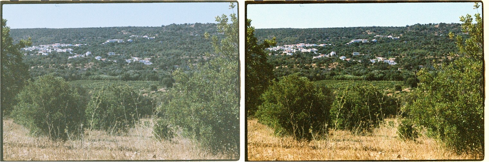
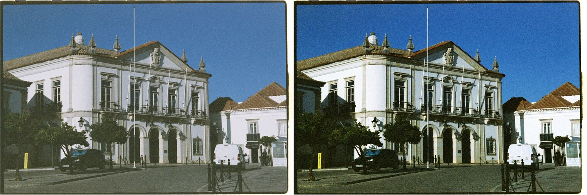
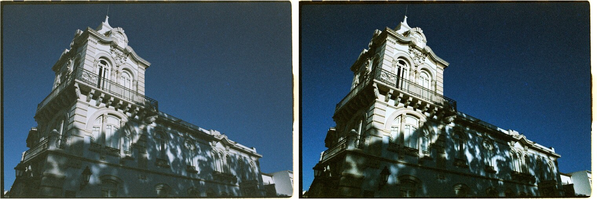
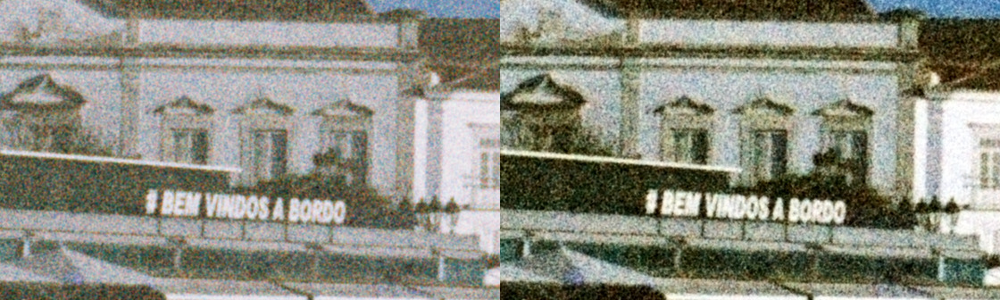

# lomo-color-92-correction

Re-balance flat, bleached lab scans of
[Lomography LomoChrome Color '92](https://shop.lomography.com/eu/lomochrome-color-92-35-mm-iso-400).

I really like the look, grain and retro colours of this filmstock, when scanned
correctly. Unfortunately, as its emulsion is rather unique, most labs don't know
how to coax the right look out of it, and scan it with a preset for a basic Kodak
Gold or Ultramax or Fuji 200, which leaves the film looking washed out and
redshifted. This script is an attempt to automatically apply the colour
corrections that you would want, if you were scanning it yourself in SilverFast.





*Before, after. Same frames.*

```bash
lomo92fix ~/scans/"47791 Lomography Color 92" --jpeg
```

Writes 16-bit TIFFs to a sibling `… - corrected` directory, plus preview JPEGs
with `--jpeg`. Originals are never touched, and it refuses to write into the
source directory.

---

## Wrong negative preset, wrong colour balance

Measured across a 33-frame roll, inside the scanner border:

| | measured | normal |
|---|---|---|
| black point (P1) | **64 / 255** | 0–10 |
| white point (P99) | **220 / 255** | 245–255 |
| range used | **61%** | ~95% |
| mean saturation | **0.265** | 0.35–0.50 |

Photos come out with a squashed range of colours and tones, like they were
underexposed and then bleached. This is because the labs (or Silverfast) are
trying to correct for an unrelated emulsion, and the colour reversal
results in the wrong tones.

### The whites are already neutral

From a few shots of mine:

| region | measured | should be |
|---|---|---|
| white walls | R/G **1.008**, B/G **1.031** | ~1.00 |
| sunlit foliage | R/G **0.894** | 0.55–0.80 |
| clear sky | R/B **0.682** | 0.45–0.65 |

Saturation is lost by the mis-scans. Colours
have collapsed toward grey. Because red dominates that collapse, the result
*reads* as a red cast, with foliage going olive-brown and blue sky going purple,
even while the frame as a whole still averages cool.

That distinction is the whole problem. It is why white balance sliders take so
much finagling and still never work. They are the wrong control for the defect.

### Grey-world estimators make it worse

Any grey-world or auto white balance estimator measures R/G below 1 on this roll
and concludes red is *deficient*, so it adds red, pushing the frame deeper into
the cast you were complaining about. Every automatic approach tried here failed
that way, per-frame and roll-aggregated alike.

Restoring chroma fixes the apparent cast. Correcting white balance deepens it.
The `--neutral` flag exposes the grey-world behaviour and defaults to `0`.

### Vibrance, not saturation

The factor that lands foliage on its reference is about 2.0, and the same value
puts sky at R/B 0.46. But a *flat* multiplier at that strength turns dry tan
grass into neon orange. It helps the washed-out midtones and wrecks anything
that kept its colour.

That was worth checking rather than assuming: clamping the white balance gain
hard on the offending frame barely moved it. The grass is genuinely tan in the
original and the multiplier was the problem, so no white balance change would
ever have fixed it.

So the boost tapers with existing chroma, full strength near grey and halving at
`--knee`. Bleached midtones get rescued, subjects that still had colour do not.

### Every frame is measured and corrected on its own terms

Nothing here is a fixed recipe. Each frame gets read first, and the corrections
are solved for that frame: its colour cast from its own near-neutral pixels, its
shadow cast from its own shadows, and the vibrance solved by bisection until the
frame is predicted to land on `--target-saturation`.

That matters because rolls arrive in very different states. 
I have tested this across a couple of rolls, from different locations,
developed by different labs. They all display the same problem with this
filmstock although not exactly in the same way.

| roll | source saturation | corrected |
|---|---|---|
| Algarve, lab A | 0.268 | **0.488** |
| Portland, lab B | 0.423 | **0.484** |

A frame that already carries colour gets a vibrance of 1.0 and is left alone; a
bleached one gets the full boost. Both end up in the same place, which is what a
fixed multiplier cannot do.

Frames are also protected from being over-corrected. `--max-stretch` stops a very
flat frame being pulled to full range, since spreading 31% of the scale across
all of it mostly magnifies grain, and the chroma blur radius scales with image
width so a half-size scan does not get its colour smeared.

### There is also a per-frame cast, and a shadow cast

Separately from the global bleaching, bright near-neutral pixels vary across the
roll with **sd 0.067 in R/G and 0.061 in B/G**, an order of magnitude above
measurement noise. Small, but visible once the chroma is back.

`highlight_gains` measures it from bright, low-saturation pixels: white walls,
pale stone, cloud. That is safer than grey-world because it never assumes the
scene averages grey, only that something white-ish is in shot. A frame with no
such reference is left alone rather than guessed at.

Balancing the highlights then leaves the *shadows* wherever the film put them,
and on this stock that is strongly yellow. Mid-shadow B/G measures 0.36 to 0.84
on the worst frames, where open shade lit by blue sky should sit above 1.0. So
there is a second grey balance point for the shadows, faded out by tone. Two
balance points make it a per-channel curve rather than one flat gain, which is
the only thing that can fix a cast differing between shadows and highlights.

Gains are clamped (`--wb-clamp`). One frame's estimator asks for 2.41x on red,
which is not a correction but a failed estimate locking onto something coloured.
Clamping leaves that frame under-corrected instead of ruined.



### The magenta grain

Restoring colour also restores colour *noise*. On the raw scans, red measures
1.3 to 1.8 times noisier than green on every frame, and in chroma terms red and
blue are both several times noisier, so the speckle reads magenta.



*Detail at 1:1. Colour speckle goes, film grain stays.*

The denoiser blurs the colour difference from luma and never luma itself, so
grain and fine detail survive. It runs last, cleaning the noise the chain
actually produced rather than a smaller version of it earlier. It works on
differences rather than channel/luma ratios, because dividing by luma makes the
noise estimate explode in the dark areas where speckle is worst. And it uses two
scales, because residual chroma noise keeps climbing out to a radius of 32: the
fine speckle sits on much larger colour blotches a small radius cannot see.

Red chroma noise on one frame went 4.64 to 1.19.

---

## Pipeline

```
white balance -> vibrance -> white balance -> endpoints -> contrast -> chroma denoise
```

Colour work happens in linear light, where a gain is what it claims to be. Tone
work happens in display space, where the eye judges it.

White balance appears twice on purpose. Before the boost, because vibrance
scales distance from grey and would multiply any cast along with the wanted
colour. After it, because vibrance lifts low-chroma pixels hardest, which is
exactly where leftover cast sits, so one pass beforehand leaves an error the
boost amplifies. Measured over 13 frames:

| ordering | R/G sd | B/G sd |
|---|---|---|
| before only | 0.088 | 0.057 |
| after only | 0.087 | 0.061 |
| **both** | **0.043** | **0.030** |

---

## Options

| flag | default | note |
|---|---|---|
| `--target-saturation` | 0.42 | solved per frame; the main control |
| `-S, --saturation` | — | fixed vibrance instead of solving for a target |
| `--max-vibrance` | 3.0 | ceiling on the solved vibrance |
| `--knee` | 0.22 | chroma at which the boost halves; lower protects colourful subjects |
| `-w, --wb` | 1.0 | per-frame white balance strength; 0 disables |
| `--wb-clamp` | 1.55 | cap on any single channel gain |
| `--shadow-wb` | 0.8 | second grey balance point for the shadows |
| `-t, --contrast` | 0.15 | S-curve amount |
| `-c, --chroma` | 0.9 | chroma noise reduction, 0 to 1 |
| `-R, --chroma-radius` | 5 | sized to grain at 6144px wide; lower for smaller scans |
| `--black` / `--white` | 0.4 / 99.7 | endpoint clip percentiles |
| `--max-stretch` | 3.2 | most a frame's range may be stretched |
| `-n, --neutral` | 0.0 | grey-world share; leave at 0, see above |
| `-o, --out` | sibling dir | destination |
| `--jpeg` | off | also write 1600px previews |
| `--only` | — | glob filter, e.g. `'0000[45]*'` |
| `--overrides` | — | YAML or JSON of per-frame settings |

`lomo92fix --help` prints the same with explanations.

TIFF, JPEG and PNG input all work. Output is always 16-bit TIFF, because the
stretch pulls a limited set of source levels across the full range and 16 bits
keeps later edits from compounding the gaps into banding.

### Per-frame overrides

Most frames need nothing. For the occasional one that does, `--overrides` takes a
file keyed by filename without extension, with any of the long option names:

```yaml
"000057":
  target_saturation: 0.34
  contrast: 0.06
  max_stretch: 2.0

"000062":
  target_saturation: 0.32
  chroma: 0.97
```

```bash
lomo92fix ~/scans/roll --overrides roll.yml
```

---

## Install

Needs [libvips](https://www.libvips.org/), which does the pixel work.

```bash
# Fedora
sudo dnf install vips vips-devel
# Debian/Ubuntu
sudo apt install libvips libvips-dev
# macOS
brew install vips
```

Then:

```bash
bundle install
./bin/lomo92fix --help
```

## Known limits

- These are 8-bit lab TIFFs. A 61%-range 8-bit file has roughly 155 distinct
  levels to stretch across the full range, so shadow gradation is thin by
  construction. **The real fix is upstream:** ask the lab for flat or linear
  scans, or raw DNG, and invert from the actual data. The same applies to home
  scanning, where scanning flat and inverting yourself beats fighting a profile
  that has never heard of this film.
- Rotated frames are left rotated. Guessing orientation quietly ruins a batch.
- Endpoints are per-frame, so a deliberately low-key frame gets stretched like
  any other.
- The white balance estimator needs something white-ish in shot. Given none, it
  declines to guess, which is the right failure mode but leaves that frame
  uncorrected.
- One frame on the reference roll is a genuine outlier at R/G 0.663 where every
  other frame sits above 0.94. It needs manual work.

## Why this film specifically

The evidence says the emulsion, not any one lab. Three rolls were measured: one
from the Algarve developed and scanned by one lab, two from Portland shot on a
different camera body and handled by a different lab entirely.

| | Algarve, lab A | Portland, lab B | Portland, lab B |
|---|---|---|---|
| black point | 65.2 | 59.9 | 49.0 |
| white point | 219.7 | 204.7 | 222.9 |
| range used | 61% | 57% | 68% |
| highlight R/G | 0.983 | 1.025 | 0.968 |
| mid-shadow B/G | 0.922 | **0.520** | **0.644** |

Every roll: lifted black point, capped white point, neutral highlights, yellow
shadows. Two labs on two continents do not independently invent the same defect.

The likely mechanism is that scanner software has no profile for this emulsion
and reaches for the nearest thing it knows, so its auto black point never gets to
the bottom and the colour rendering is built for a film this is not. SilverFast's
NegaFix has no entry for it either and behaves much the same, which fits the
problem following the film into home scanning as well.

## Licence

MIT.
